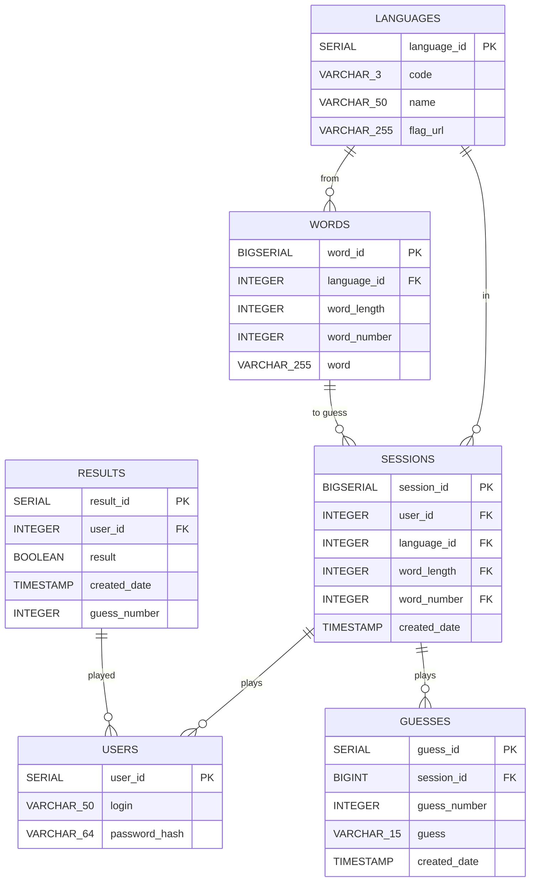
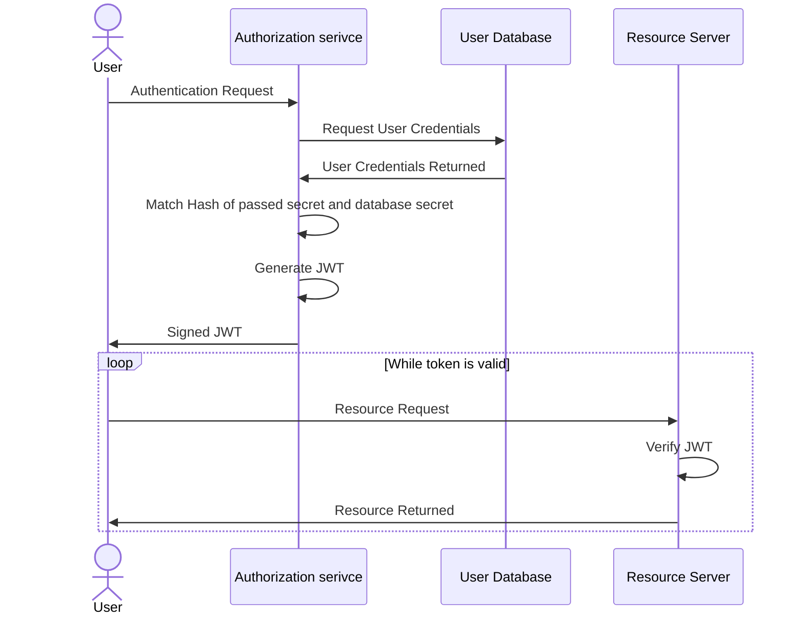

# Web Application Programming
## Wordle Project Documentation

### Topic
Wordle - a game based on guessing a five-letter word. The user has six attempts, and after each attempt, the game informs them whether the used letters are in the word-answer and in what exact position, whether they are in the word-answer but in a different position, or if they are not in the word-answer at all.

### Implementation

#### Database

#### Database

The PostgreSQL 15.2 database "wordledb" operates in a Docker environment on localhost, port 5432. On the database side, we did not use any programming, only serial types were used to automate assigning identifiers to rows. It is mainly used to store data collected for the application's needs. The entire structure is formulated in the file DATABASE/scripts/DATABASE_CREATE.sql.




#### Back End

The backend consists of two independent services: `SESSION` and `AUTHORIZATION`.

SESSION is responsible for managing the gameplay. Logged-in users can request to start a session (game). During the game, they submit words with subsequent requests. The service verifies if the word is correct and returns the result.

AUTHORIZATION is responsible for managing users and ensuring security. This service enables registration and login. In the project, we utilized JSON Web Token for authentication. The general outline of our security model:




**Building the Project**

We utilized the `gradle` tool for automatic building within the project. The project can be run from the command line by executing:


```
./gradlew clean build bootRun
```

**Swagger**

To facilitate testing of the service, we added a Swagger endpoint to the projects. It allows for easy invocation of endpoints without using external tools. After launching Docker, Swagger is accessible at the following addresses respectively: http://localhost:7777/swagger and http://localhost:7788/swagger

#### Front End

<!--  -->
The frontend part of the application consists of 3 files located in the subfolder `public-html` of the `FE` folder, namely `index.html`, `style.css`, and `app.js`.

HTML:

- The HTML file contains the structure of the web page. It consists of various elements such as headers, sections, etc.
- The application title "Wordle" is placed in the header section.
- The main section contains an area where the current state of the game will be displayed, i.e., guessing attempts and their results, as well as an auxiliary keyboard illustrating used letters.
- In the top right corner of the application, there are three buttons: for changing the theme (default: `dark` and `light`), logging in, and registering. Clicking the last two buttons displays a pop-up window (via redirection to the appropriate URL).

CSS:

- The CSS stylesheet is used to define the appearance and layout of HTML elements.
- Different styles such as colors, fonts, margins, alignment, background, etc., are applied to various elements to give the application an attractive look.
- An external CSS library - Material Icons, is used to access ready-made icons.

JavaScript:

- JavaScript script is used to add interactivity to the application.
- Functions handling various events are defined, such as clicking the "Enter" button.
- In addition to entering the guessed word using the aforementioned on-screen keyboard (which is a key mechanism for e.g., using the application on a mobile device), for user convenience, there is also an option to enter subsequent letters using the physical computer keyboard.
- Asynchronous fetch calls are used to communicate with the Backend; the "conversation" involves sending appropriate HTTP requests.

### Launch
1. Deploy the images on which the application is built using the command `docker compose up --build`.
2. Wait until all containers finish the startup process (typically identifiable by `Application availability state ReadinessState changed to ACCEPTING_TRAFFIC` in the `session` container logs).
3. In the browser, navigate to `localhost` and enjoy the game (important to use **localhost**, not 127.0.0.1, due to CORS (Cross-Origin Resource Sharing), as only the address http://localhost/ will be accepted by the Backend.

### Examples

- Game screen (dark mode):

- Game screen (light mode):

- Registration window:

- Login window:

